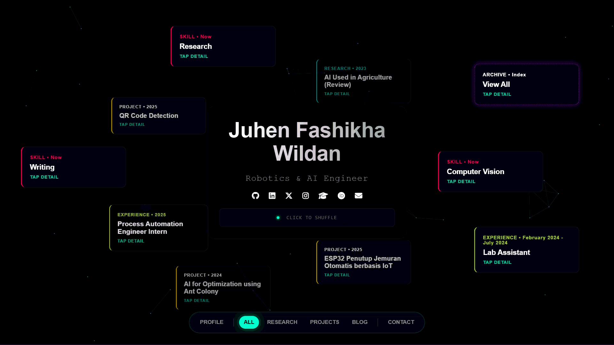

# 🧠 Neural Network Portfolio

> **"Bridging academic knowledge with real-world innovation."**

A **Sci-Fi / Cyberpunk** themed interactive portfolio website that simulates a "Digital Cortex" interface. Built to showcase profile, research, and technical projects using connected data nodes visual style.

🌐 **Live Demo:** [juhenfw.github.io](https://juhenfw.github.io)



---

## ✨ Key Features

* **Interactive Neural Network:** Dynamic particle background using **P5.js** that responds to mouse movement.
* **Single-Page Dashboard:** Immersive, non-scrolling dashboard interface (desktop) that feels like a native app or terminal.
* **Centralized Data Management:** All content (Profile, Experience, Skills) is managed via a single JSON file (`mind.json`).
* **Glassmorphism UI:** Modern design with blur effects, neon glowing borders, and futuristic typography.
* **Adaptive Blog System:** A separate, fully responsive blog system with optimized reading mode, fluid typography, and terminal-style code blocks.
* **Mobile Optimized:** The layout automatically adapts to a card-based scrolling view on mobile devices for better usability.

---

## 🛠️ Technology Stack

Built with pure **Vanilla Web Technologies** for maximum performance, no heavy frameworks required.

* **HTML5:** Semantic Structure.
* **CSS3:** Flexbox, Grid, CSS Variables, Animations, Media Queries.
* **JavaScript (ES6+):** DOM Manipulation, JSON Parsing, Logic.
* **P5.js:** Creative Coding Library for the particle background.
* **Font Awesome:** Vector Icons.
* **Google Fonts:** 'Space Grotesk' & 'JetBrains Mono'.

---

## 📂 Project Structure

Understanding the folder structure is key to managing this website:

```plaintext
juhenfw.github.io/
│
├── index.html          # Main Dashboard (The Core)
├── style.css           # Global Styles & Variables (Cyberpunk Theme)
│
├── assets/             # Image Assets (Profile, Logo, Screenshots)
│
├── data/
│   └── mind.json       # 🧠 THE BRAIN (Edit all text content here)
│
├── js/
│   ├── brain.js        # System Logic (JSON Parsing, Event Listeners)
│   └── sketch.js       # Visual Core (P5.js Particle System)
│
└── blog/               # Separate Blog System
    ├── template.html   # Master Template for creating new articles
    ├── blog-style.css  # Specialized CSS for reading mode
    └── article-01.html # Example article file
```

---

## 🚀 Installation & Usage

Follow these steps to run the website on your local machine:

### 1. Clone the Repository
```bash
git clone https://github.com/juhenfw/juhenfw.github.io.git
cd juhenfw.github.io
```

### 2. Run Local Server
Since this website fetches an external JSON file (`mind.json`), you **cannot** simply double-click `index.html`. You need a local server to avoid CORS errors.

* **Using VS Code (Recommended):**
    1.  Install the **"Live Server"** extension.
    2.  Right-click `index.html`.
    3.  Select **"Open with Live Server"**.

* **Using Python:**
    ```bash
    # Run this command in the project folder
    python -m http.server 8000
    ```
    Then open `http://localhost:8000` in your browser.

---

## ⚙️ Customization Guide

### Step 1: Identity & Branding
Replace the default images in the `assets/` folder:
* `profile.jpg`: Your profile picture (Recommended ratio 1:1, max 400px).
* `logo.png`: Your site favicon.

### Step 2: Content Management (The Mind)
Open **`data/mind.json`**. This is the single source of truth for your data. You don't need to touch the HTML to update your experience or skills.

**Example Data Structure:**
```json
{
  "profile": {
    "name": "Your Name",
    "role": "Your Job Title",
    "tagline": "Your short bio..."
  },
  "nodes": [
    {
      "id": "exp-company-a",
      "type": "experience",  // Options: experience, research, project, skill
      "title": "Software Engineer",
      "priority": 9          // 9-10 = Always visible, <8 = Randomized
    }
  ]
}
```

### Step 3: Writing a New Blog Post
1.  Go to the `blog/` folder.
2.  Duplicate the `template.html` file.
3.  Rename it (e.g., `my-new-project.html`).
4.  Edit the HTML content. The template supports:
    * `<pre><code>` for terminal-style code blocks.
    * `<div class="table-wrapper">` for responsive data tables.
    * `<div class="video-container">` for YouTube embeds.
5.  Register the new article in `data/mind.json` with `"type": "blog"`.

---

## 🎨 Color Palette (CSS Variables)

You can easily change the color theme by editing `:root` variables in `style.css`:

```css
:root {
    --primary-color: #00ffc8;    /* Main Neon Cyan */
    --secondary-color: #aa00ff;  /* Accent Neon Purple */
    --bg-color: #05080c;         /* Deep Dark Background */
}
```

---

## 🤝 Contribution

Contributions are welcome! If you find a bug or want to add a feature:
1.  Fork this repository.
2.  Create a feature branch (`git checkout -b feature-name`).
3.  Commit your changes.
4.  Push to the branch.
5.  Create a Pull Request.

---

## 📄 License

Distributed under the **MIT License**. Feel free to use, modify, and redistribute for personal or commercial projects. Attribution is appreciated but not required.

---

<p align="center">
  Built with 💻 and ☕ by <strong>Juhen Fashikha Wildan</strong>
</p>
